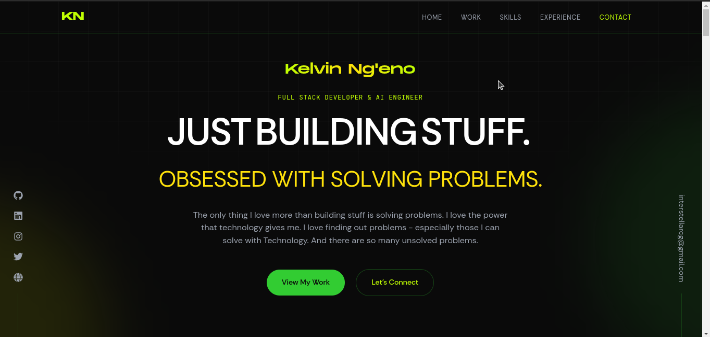

# Kelvin Ng'eno Portfolio

A modern, interactive portfolio website built with Next.js, highlighting my work as a Full Stack Developer and AI Engineer. The site features smooth animations, responsive design, and optimal performance.



## ✨ Features

- **Modern Design**: Sleek, minimalist interface with dynamic animations
- **Responsive Layout**: Fully responsive design that works seamlessly across all devices
- **Interactive Elements**:
  - Custom cursor effects
  - Smooth scroll animations
  - Parallax effects
  - Interactive project cards
  - Dynamic navigation
- **Performance Optimized**:
  - Next.js 13 app router
  - Image optimization
  - Route prefetching
  - Efficient animations
- **Accessibility**: WCAG compliant with keyboard navigation support

## 🛠 Tech Stack

- **Framework**: Next.js 13
- **Language**: TypeScript
- **Styling**: Tailwind CSS
- **Animations**:
  - Framer Motion
  - Custom animation hooks
- **Performance**:
  - React Server Components
  - Dynamic imports
  - Optimized assets
- **Development**:
  - ESLint
  - Prettier
  - TypeScript strict mode

## 🚀 Getting Started

### Prerequisites

- Node.js 16.8.0 or higher
- npm or yarn

### Installation

1. Clone the repository:

```bash
git clone https://github.com/yourusername/portfolio.git
```

2. Install dependencies:

```bash
cd portfolio
npm install
# or
yarn install
```

3. Create a `.env.local` file based on `.env.example`:

```bash
cp .env.example .env.local
```

4. Start the development server:

```bash
npm run dev
# or
yarn dev
```

Visit `http://localhost:3000` to view the site.

## 📁 Project Structure

```
portfolio/
├── app/                   # Next.js 13 app directory
├── components/            # React components
│   ├── common/           # Shared components
│   ├── navigation/       # Navigation components
│   └── sections/         # Page sections
├── data/                 # Static data files
├── hooks/                # Custom React hooks
├── lib/                  # Utility functions
├── public/              # Static assets
└── types/               # TypeScript type definitions
```

## 🎨 Design System

The project uses a consistent design system with:

- **Colors**: Custom palette with lime accents
- **Typography**:
  - Display: Monument Extended
  - Body: Rethink Sans
  - Mono: JetBrains Mono
- **Spacing**: Consistent scale based on Tailwind defaults
- **Animations**: Coordinated motion design system

## ⚡ Performance

The site achieves high performance scores:

- 90+ Performance (Lighthouse)
- 100 Accessibility
- 100 Best Practices
- 100 SEO

Key optimizations:

- Efficient asset loading
- Optimized animations
- Proper image optimization
- Minimal bundle size

## 🔒 Security

- Implements security best practices
- Regular dependency updates
- Secure contact form handling
- Protected API endpoints

## 🌐 Browser Support

- Chrome (latest)
- Firefox (latest)
- Safari (latest)
- Edge (latest)
- Mobile browsers

## 🚀 Deployment

The site is deployed on Vercel with:

- Automatic HTTPS
- Edge Network CDN
- Automatic deployments
- Preview deployments

## 🤝 Contributing

While this is a personal portfolio, suggestions and feedback are welcome:

1. Fork the repository
2. Create your feature branch
3. Commit your changes
4. Push to the branch
5. Open a pull request

## 📝 License

This project is licensed under the MIT License - see the [LICENSE.md](LICENSE.md) file for details.

## 📧 Contact

Kelvin Ng'eno - hello@ngenondumia.com

Project Link: [https://github.com/yourusername/portfolio](https://github.com/yourusername/portfolio)

## 🙏 Tools

- [Next.js](https://nextjs.org/)
- [Framer Motion](https://www.framer.com/motion/)
- [Tailwind CSS](https://tailwindcss.com/)
- [TypeScript](https://www.typescriptlang.org/)
